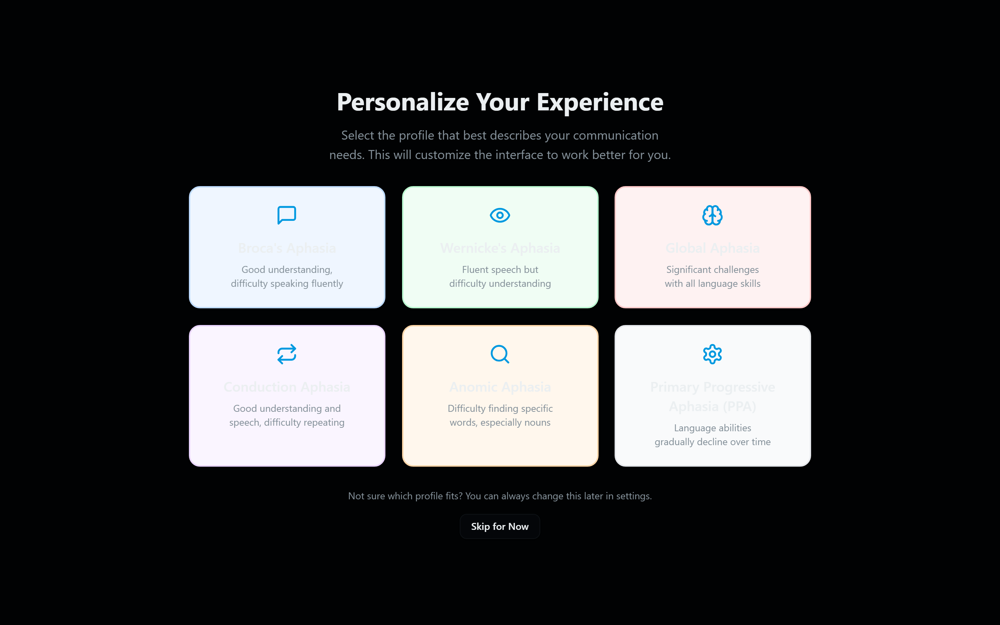
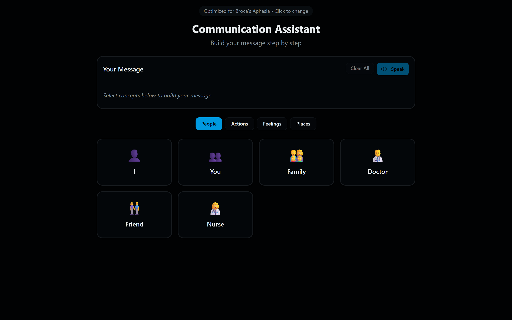
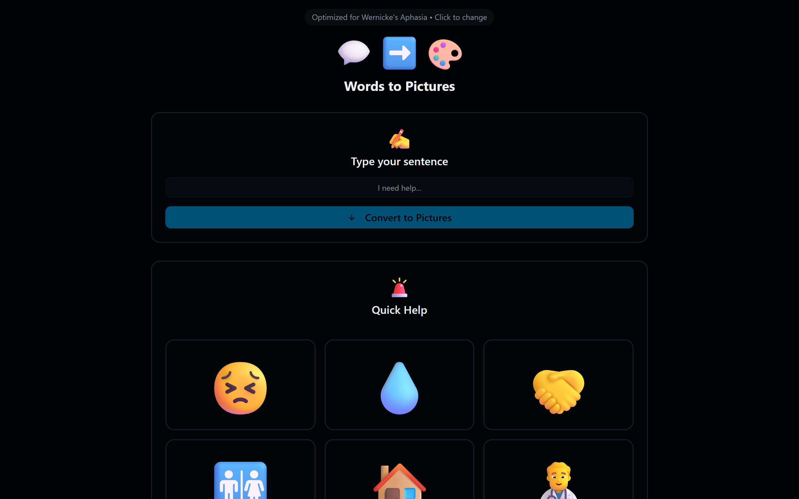
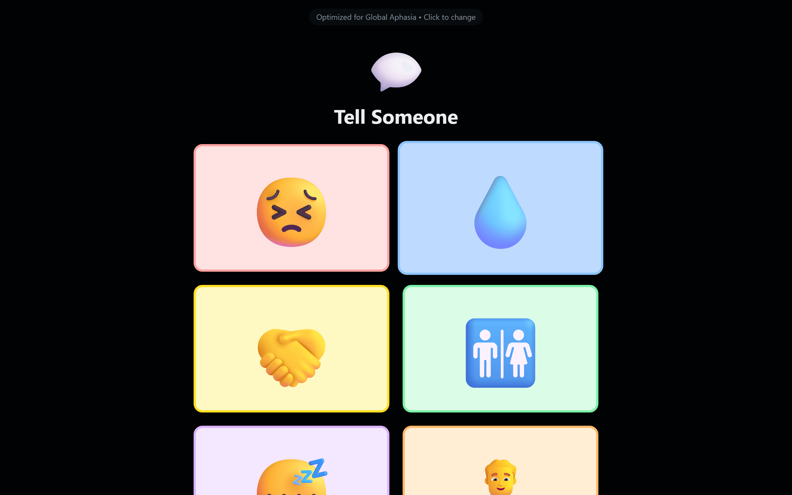
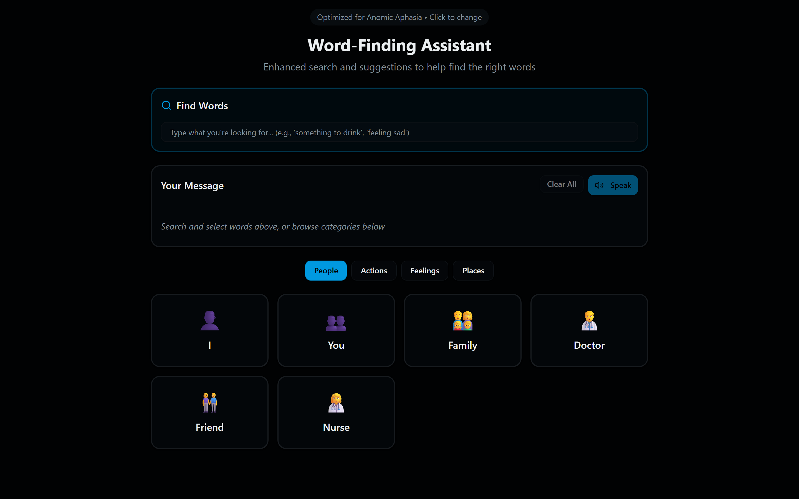
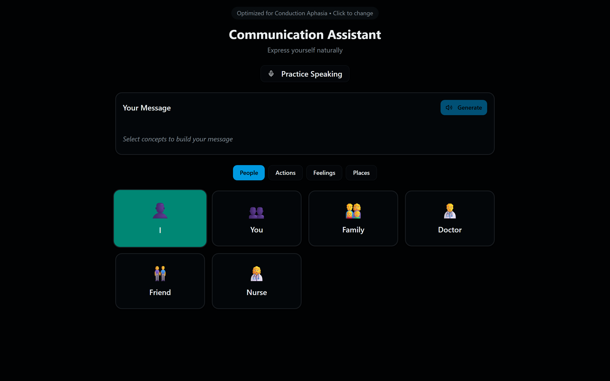
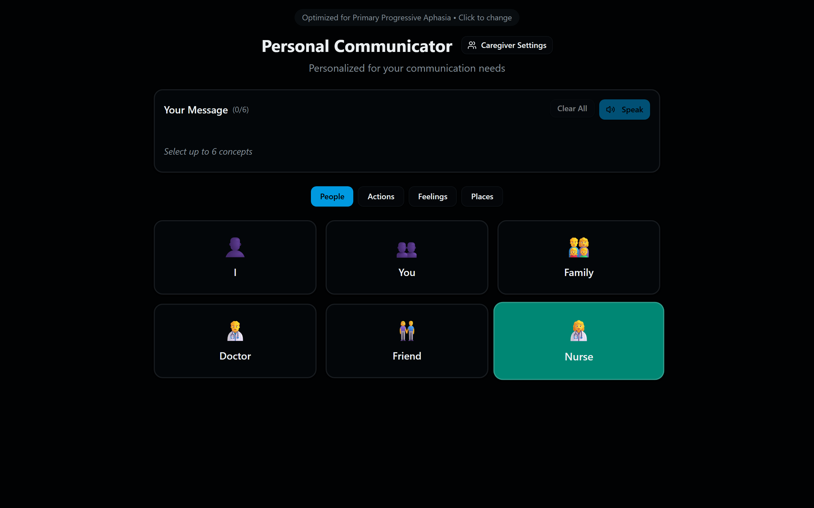

# Concept to Speech

> An augmentative and alternative communication aid for people with aphasia, built around the fact that different aphasias break language in different places.

**VOID 2025, VIT Chennai — semi-finalist.**



## The problem

Aphasia is an acquired language disorder, most often following a stroke. Roughly a third of stroke survivors experience it. It does not affect intelligence, and it does not affect what a person wants to say — it affects the machinery that turns intention into words.

Most augmentative and alternative communication (AAC) tools present one grid of words and symbols to every user. That design comes from AAC's origins in developmental disability, where a single stable vocabulary board serves well. Aphasia does not work that way, because aphasia is not one condition:

- **Broca's aphasia** leaves comprehension largely intact and breaks production. The person knows exactly what they want to say and cannot assemble the sentence. Speech is effortful and telegraphic — content words without the grammar between them.
- **Wernicke's aphasia** leaves production fluent and breaks comprehension. Speech comes easily but has lost its anchor to meaning, and — critically — the speaker often cannot hear that it has. Self-monitoring is impaired.
- **Anomic aphasia** leaves both grammar and comprehension intact and breaks retrieval. The person can describe the object, its use, where they saw it last, and cannot reach the noun.
- **Conduction aphasia** leaves comprehension and spontaneous speech mostly intact and breaks repetition specifically.
- **Global aphasia** affects all modalities severely, leaving a small set of reachable expressions.
- **Primary progressive aphasia** is degenerative rather than sudden, so ability changes over months.

A single interface optimised for one of these actively obstructs the others. A word grid that helps someone with Broca's aphasia assemble a sentence is close to useless for anomic aphasia, where the problem is reaching the word, not ordering it. A confirmation-heavy flow that protects a Wernicke's user from fluent-but-wrong selection is friction for everyone else.

## Approach

The application selects an interaction model based on aphasia type rather than exposing one universal board. Six are implemented, each matched to the specific breakdown:

| Type | Interaction model | Why |
|---|---|---|
| Broca's | Concept pills assembled into utterances, grammar supplied by the system | Intention is intact; the system contributes the connective tissue |
| Wernicke's | Semantic search with explicit confirmation before speaking | Guards against fluent-but-wrong selection where self-monitoring is impaired |
| Global | Minimal high-frequency phrase set, maximum reachability | Fewer, larger targets when all modalities are affected |
| Conduction | Paths that avoid repetition-dependent interaction | Repetition is the specific deficit; do not build on it |
| Anomic | Retrieval by category and by description | The word is known but unreachable — route around it semantically |
| PPA | Layout that adapts as ability changes over time | Loss is progressive, so a fixed layout expires |

Underneath, a shared concept vocabulary — people, actions, feelings, needs, places — is composed into utterances, expanded into natural sentences by a language model, and spoken aloud. The concept layer is deliberately common across all six; only the path to it differs.

### The retrieval problem

The most interesting engineering question here is anomic retrieval. When someone cannot reach a word but can describe it, keyword search fails by construction — they do not have the keyword. The `semantic-search` route embeds the description and matches against the concept vocabulary in vector space, so "the thing you drink from in the morning" resolves to the cup concept without the word ever being typed.

## Features

| Capability | How it works |
|---|---|
| Aphasia-type routing | Six distinct interaction models selected at onboarding, switchable later |
| Concept composition | Categorised concept pills assembled into an utterance |
| Sentence deconstruction | `deconstruct-sentence` breaks a target sentence into selectable concepts, used only by the Wernicke's flow |
| Predictive suggestion | `suggest-concepts` and `word-suggestions` predict the likely next concept in context |
| Description-based retrieval | `semantic-search` matches a description against the concept vocabulary; falls back to a local match over the same vocabulary without a key |
| Sentence expansion | `generate-speech` expands the assembled concepts into a sentence with a profile-specific prompt |
| Speech output | The browser's Web Speech API speaks the result; Global speaks at a reduced rate for clarity |
| Quick phrases | High-frequency expressions reachable in one tap |
| Persistent profile | Aphasia type and preferences retained across sessions |

## Screenshots

Each capture is the same application immediately after selecting a different
aphasia type at onboarding. Nothing else was changed between them.

### Broca's — concept composition



Comprehension is intact, so the interface offers a full categorised concept
vocabulary and an utterance bar. The person assembles meaning; the system supplies
the grammar on speak.

### Wernicke's — type, then deconstruct



Production is fluent and comprehension is not, so the flow inverts: a target
sentence is typed or chosen, then broken into pictures for confirmation before
anything is spoken. This is the only experience that routes through
`deconstruct-sentence`.

### Global — six reachable needs



All modalities are severely affected, so the board collapses to six large,
high-contrast picture tiles that speak on tap at a deliberately slow rate. No
composition step, no text entry.

### Anomic — retrieval by description



Grammar and comprehension are intact and retrieval is not, so the primary control is
a "Find Words" box that accepts a description rather than the word — "something to
drink" instead of "cup".

### Conduction — composition without repetition



Repetition is the specific deficit, so the interaction avoids repeat-after-me
patterns and keeps the concept board with mixed icon-and-text targets.

### Primary progressive aphasia — a layout that can be tuned



Loss is gradual rather than sudden, so this experience exposes the most
configuration — the layout is expected to be re-tuned as ability changes.

## Architecture

```
Aphasia type selection
        │
        ▼
┌───────────────────────────────────────────────────────┐
│  Experience layer — one per aphasia type              │
│  Broca · Wernicke · Global · Conduction · Anomic · PPA │
└───────────────────────────────────────────────────────┘
        │
        ▼
Shared concept vocabulary  (people · actions · feelings · needs)
        │
        ▼
┌──────────────────────── API routes ────────────────────────┐
│ deconstruct-sentence · suggest-concepts · word-suggestions │
│ semantic-search · generate-speech                          │
└────────────────────────────────────────────────────────────┘
        │
        ▼
   Spoken output
```

The experience layer is the only part that varies by aphasia type. Everything below it — vocabulary, composition, synthesis — is shared. Adding a seventh aphasia type means adding one experience component, not a second application.

## Tech stack

| Layer | Technology | Why |
|---|---|---|
| Framework | Next.js App Router | Server routes and client UI in one deployable unit |
| Language model | Groq AI SDK | Latency matters — a communication aid that pauses is a communication aid that gets abandoned |
| UI primitives | Radix UI, shadcn/ui | Accessible components by default, which is the entire point here |
| Speech | Web Speech API | Synthesis in the browser, with no paid speech service and no audio leaving the device |
| Styling | TailwindCSS | |
| Types | TypeScript | |

## Getting started

### Prerequisites

- Node.js 18 or later
- pnpm
- A Groq API key

### Installation

```bash
git clone https://github.com/varadharajanv0310/concept-to-speech.git
cd concept-to-speech
pnpm install
```

### Configuration

```bash
cp .env.example .env.local
```

| Variable | Required | Purpose |
|---|---|---|
| `GROQ_API_KEY` | Yes | Concept suggestion, semantic search, sentence expansion |

Without a key the six experiences, concept boards, quick phrases and browser speech all work. What degrades is the language-model layer: sentence expansion, predictive suggestion and semantic retrieval, the last of which falls back to a local match over the same vocabulary.

### Running

```bash
pnpm dev                   # http://localhost:3000
```

## Project structure

```
concept-to-speech/
├── app/
│   ├── api/               # five language routes (see Architecture)
│   └── page.tsx           # aphasia-type routing entry point
├── experiences/           # one component per aphasia type
├── components/            # concept pills, search, suggestions, settings
└── contexts/              # ProfileContext — persisted aphasia type and preferences
```

## Limitations

This is a hackathon prototype and should be read as one.

- **Not a medical device.** It has not been evaluated with clinical users, reviewed by a speech-language pathologist, or tested against any AAC efficacy standard.
- The aphasia-type interaction models are derived from published characterisations of each type, not from clinical trial evidence about what works in practice.
- English only. Aphasia interacts with multilingualism in ways this does not model.
- No offline mode. Every suggestion and synthesis call requires a network round trip, which is a poor assumption for an assistive tool.
- Type selection is manual at onboarding rather than assessed.

## Roadmap

- Offline concept vocabulary and on-device synthesis, removing the network dependency
- Clinical review of each interaction model with a speech-language pathologist
- Caregiver view for configuring vocabulary around an individual's actual life
- Usage telemetry to identify which concepts are reached for and never found

## Team

Built at VOID 2025, VIT Chennai. Joint work — the repository history is authored by a teammate.
